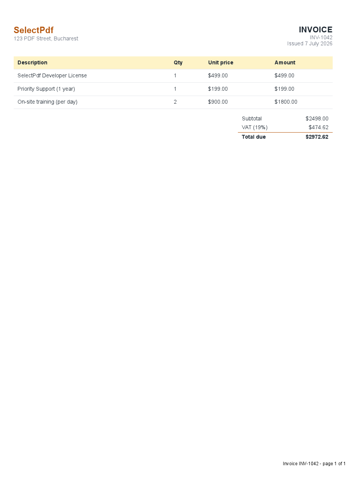
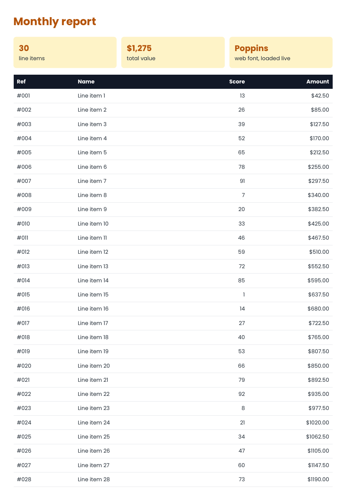
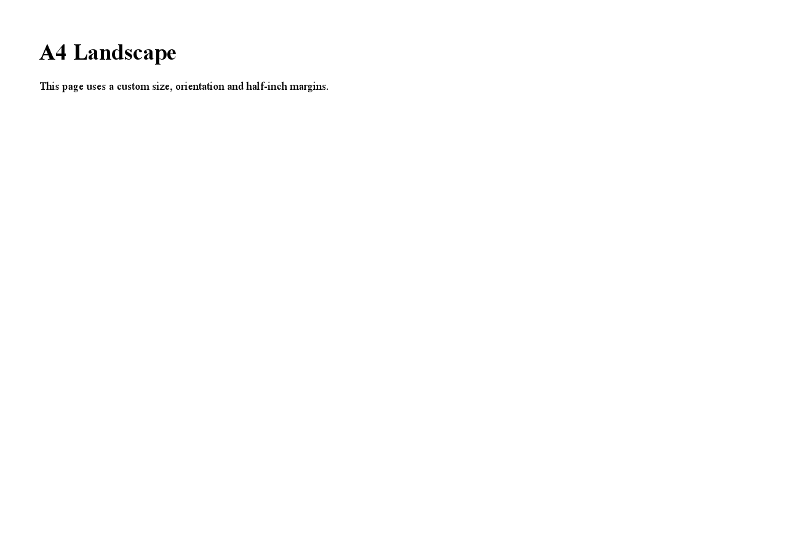
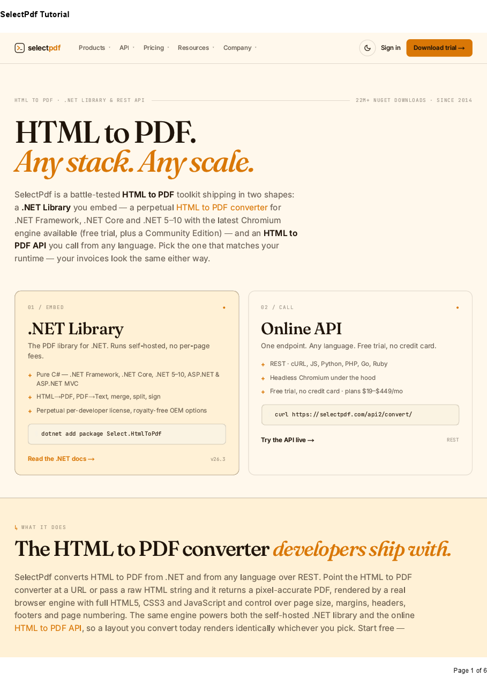
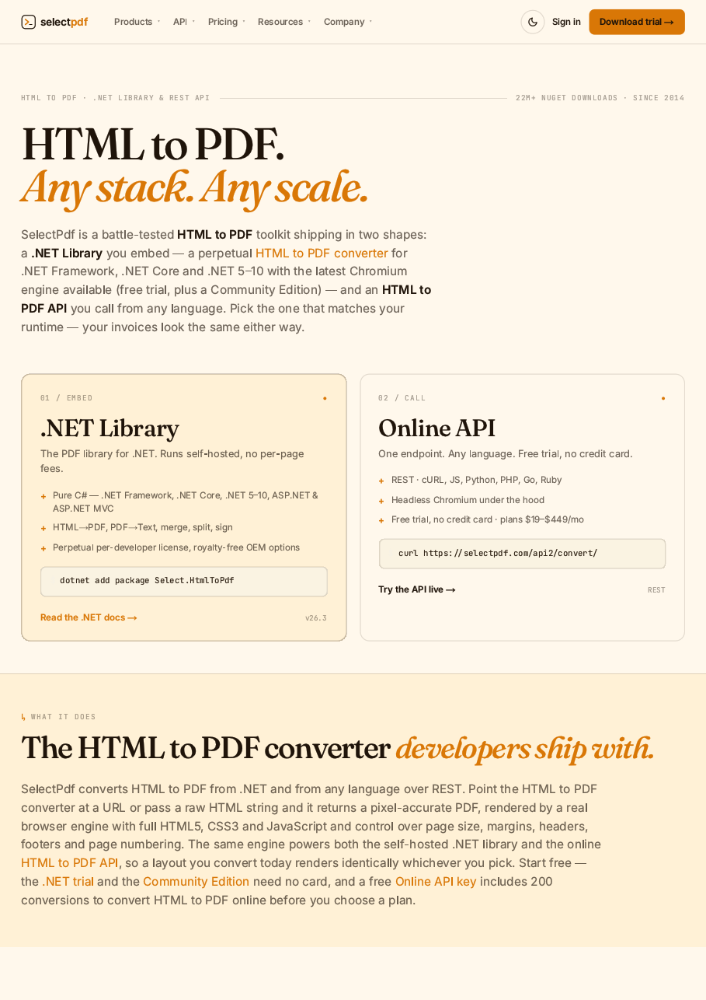

# HTML to PDF in C#

This is a complete, hands-on guide to converting HTML to PDF in C# with the [SelectPdf library for .NET](https://selectpdf.com/pdf-library-for-net/). It works up from a three-line conversion to a production-ready workflow: every one of the 19 code steps is a full, compiling example taken straight from this project and rendered with the Chromium engine, so the code you copy is code that actually runs. Along the way you will build a real invoice from a data model, render complex CSS and paginating tables, control layout, handle dynamic and authenticated pages, secure and archive your output, integrate with ASP.NET Core, and finish with notes on running in production and troubleshooting.

## Getting started

Add the SelectPdf packages, then build and run:

```bash
dotnet add package Select.Pdf.NetCore
dotnet add package Select.Pdf.NetCore.Chromium.Windows
dotnet run
```

Running the project writes each result PDF to `output/` and the preview images shown below into `images/`.

## Contents


**Part 1 - Getting started**

1. [Convert an HTML string to PDF](#1-convert-an-html-string-to-pdf)
2. [Convert a URL to PDF](#2-convert-a-url-to-pdf)
3. [Convert a local HTML file to PDF](#3-convert-a-local-html-file-to-pdf)

**Part 2 - Build a real document**

4. [Build an invoice from a template](#4-build-an-invoice-from-a-template)
5. [Render complex HTML that paginates](#5-render-complex-html-that-paginates)

**Part 3 - Control the page layout**

6. [Set page size, orientation and margins](#6-set-page-size-orientation-and-margins)
7. [Add headers and footers with page numbers](#7-add-headers-and-footers-with-page-numbers)
8. [Use HTML for headers and footers](#8-use-html-for-headers-and-footers)
9. [Generate bookmarks from HTML headings](#9-generate-bookmarks-from-html-headings)
10. [Produce a single-page PDF](#10-produce-a-singlepage-pdf)
11. [Add a watermark to every page](#11-add-a-watermark-to-every-page)

**Part 4 - Dynamic and remote content**

12. [Wait for JavaScript-rendered content](#12-wait-for-javascriptrendered-content)
13. [Inject custom CSS and run a script](#13-inject-custom-css-and-run-a-script)
14. [Control the browser viewport width](#14-control-the-browser-viewport-width)
15. [Send HTTP headers and cookies](#15-send-http-headers-and-cookies)

**Part 5 - Secure, archive, integrate**

16. [Set the document properties](#16-set-the-document-properties)
17. [Password-protect and restrict permissions](#17-passwordprotect-and-restrict-permissions)
18. [Create an archivable PDF/A-3 document](#18-create-an-archivable-pdfa3-document)
19. [Generate a PDF in ASP.NET Core](#19-generate-a-pdf-in-aspnet-core)

**Part 6 - Run it in production**

20. [Running in production](#20-running-in-production)
21. [Troubleshooting](#21-troubleshooting)

**FAQ**

22. [Frequently asked questions](#22-frequently-asked-questions)

## Part 1 - Getting started

### 1. Convert an HTML string to PDF

The simplest conversion: render a raw HTML string into a PDF document in a few lines of code.

```csharp
// Create the HTML to PDF converter and select the Chromium (CEF) engine.
HtmlToPdf converter = new HtmlToPdf();
converter.Options.RenderingEngine = RenderingEngine.Chromium;

// Convert a raw HTML string into a PDF document.
PdfDocument doc = converter.ConvertHtmlString(
    "<h1>Hello, SelectPdf!</h1>" +
    "<p>This PDF was generated from an HTML string in C#.</p>");

// Save the document to disk, then release the native resources.
doc.Save(outputPdf);
doc.Close();
```

**Output:**


> Full source: [Section01_HtmlStringToPdf.cs](Section01_HtmlStringToPdf.cs)

### 2. Convert a URL to PDF

Point the converter at any public web address and capture the rendered page as a PDF.

```csharp
HtmlToPdf converter = new HtmlToPdf();
converter.Options.RenderingEngine = RenderingEngine.Chromium;

// Convert a live web page to a PDF document.
PdfDocument doc = converter.ConvertUrl("https://www.selectpdf.com");

doc.Save(outputPdf);
doc.Close();
```

**Output:**


> Full source: [Section02_UrlToPdf.cs](Section02_UrlToPdf.cs)

### 3. Convert a local HTML file to PDF

Render an HTML file from disk - together with its local CSS and images - into a PDF.

```csharp
HtmlToPdf converter = new HtmlToPdf();
converter.Options.RenderingEngine = RenderingEngine.Chromium;

// ConvertUrl also accepts a local file path; relative CSS and images
// referenced by the file are resolved automatically.
PdfDocument doc = converter.ConvertUrl(htmlFile);

doc.Save(outputPdf);
doc.Close();
```

**Output:**


> Full source: [Section03_HtmlFileToPdf.cs](Section03_HtmlFileToPdf.cs)

## Part 2 - Build a real document

### 4. Build an invoice from a template

Turn a C# data model into a styled, real-world invoice: branded header, a line-item table, VAT totals and a page-numbered footer.

```csharp
// 1) Your data - normally from a database or an order.
var items = new[]
{
    new LineItem { Description = "SelectPdf Developer License", Qty = 1, UnitPrice = 499m },
    new LineItem { Description = "Priority Support (1 year)",    Qty = 1, UnitPrice = 199m },
    new LineItem { Description = "On-site training (per day)",    Qty = 2, UnitPrice = 900m },
};

// 2) Render the data into an HTML template (see BuildInvoiceHtml in the source).
string html = BuildInvoiceHtml("INV-1042", items);

// 3) Convert to PDF, adding a footer with page numbers.
HtmlToPdf converter = new HtmlToPdf();
converter.Options.RenderingEngine = RenderingEngine.Chromium;
converter.Options.MarginTop = 20;
converter.Options.MarginBottom = 30;

converter.Options.DisplayFooter = true;
converter.Footer.Height = 28;
PdfTextSection pageNo = new PdfTextSection(0, 8,
    "Invoice INV-1042 - page {page_number} of {total_pages}",
    new Font("Arial", 8));
pageNo.HorizontalAlign = PdfTextHorizontalAlign.Right;
converter.Footer.Add(pageNo);

PdfDocument doc = converter.ConvertHtmlString(html);
doc.Save(outputPdf);
doc.Close();
```

**Output:**



> Full source: [Section04_InvoiceTemplate.cs](Section04_InvoiceTemplate.cs)

### 5. Render complex HTML that paginates

Prove the engine handles modern CSS - grid layout and a live web font - plus a long table whose header repeats on every page.

```csharp
HtmlToPdf converter = new HtmlToPdf();
converter.Options.RenderingEngine = RenderingEngine.Chromium;

// Give the web font a moment to download before the page is captured.
converter.Options.MinPageLoadTime = 2;

// The report uses CSS grid, a Google web font, and a 30-row table.
// The table header repeats on every page (thead { display: table-header-group })
// and rows are kept whole (page-break-inside: avoid) - all controlled from CSS.
PdfDocument doc = converter.ConvertHtmlString(BuildReportHtml());

doc.Save(outputPdf);
doc.Close();
```

**Output:**



> Full source: [Section05_ComplexHtml.cs](Section05_ComplexHtml.cs)

## Part 3 - Control the page layout

### 6. Set page size, orientation and margins

Control the physical page: choose A4, switch to landscape, and set the page margins.

```csharp
HtmlToPdf converter = new HtmlToPdf();
converter.Options.RenderingEngine = RenderingEngine.Chromium;

// Page setup (margins are expressed in points; 72 points = 1 inch).
converter.Options.PdfPageSize = PdfPageSize.A4;
converter.Options.PdfPageOrientation = PdfPageOrientation.Landscape;
converter.Options.MarginLeft = 36;
converter.Options.MarginRight = 36;
converter.Options.MarginTop = 36;
converter.Options.MarginBottom = 36;

PdfDocument doc = converter.ConvertHtmlString(
    "<h1>A4 Landscape</h1>" +
    "<p>This page uses a custom size, orientation and half-inch margins.</p>");

doc.Save(outputPdf);
doc.Close();
```

**Output:**



> Full source: [Section06_PageSettings.cs](Section06_PageSettings.cs)

### 7. Add headers and footers with page numbers

Draw a repeating header on every page and a footer that shows "Page X of Y".

```csharp
HtmlToPdf converter = new HtmlToPdf();
converter.Options.RenderingEngine = RenderingEngine.Chromium;

// Enable and populate the header.
converter.Options.DisplayHeader = true;
converter.Header.Height = 40;
PdfTextSection headerText = new PdfTextSection(
    0, 12, "SelectPdf Tutorial", new Font("Arial", 10, FontStyle.Bold));
headerText.HorizontalAlign = PdfTextHorizontalAlign.Left;
converter.Header.Add(headerText);

// Enable and populate the footer with page numbering tokens.
converter.Options.DisplayFooter = true;
converter.Footer.Height = 40;
PdfTextSection footerText = new PdfTextSection(
    0, 12, "Page {page_number} of {total_pages}", new Font("Arial", 8));
footerText.HorizontalAlign = PdfTextHorizontalAlign.Right;
converter.Footer.Add(footerText);

PdfDocument doc = converter.ConvertUrl("https://www.selectpdf.com");

doc.Save(outputPdf);
doc.Close();
```

**Output:**



> Full source: [Section07_HeadersAndFooters.cs](Section07_HeadersAndFooters.cs)

### 8. Use HTML for headers and footers

Build a fully styled header or footer from an HTML fragment instead of plain text.

```csharp
HtmlToPdf converter = new HtmlToPdf();
converter.Options.RenderingEngine = RenderingEngine.Chromium;

// Render the header from an HTML fragment so it can be fully styled with CSS.
converter.Options.DisplayHeader = true;
converter.Header.Height = 50;

PdfHtmlSection header = new PdfHtmlSection(
    "<div style='font-family:Arial;color:#b45309;font-size:18px;" +
    "border-bottom:2px solid #b45309;padding:6px 0;'>Acme Corporation</div>",
    string.Empty);
header.RenderingEngine = RenderingEngine.Chromium;
header.AutoFitHeight = HtmlToPdfPageFitMode.AutoFit;
converter.Header.Add(header);

PdfDocument doc = converter.ConvertHtmlString(
    "<h1>Report body</h1><p>The header above is rendered from HTML.</p>");

doc.Save(outputPdf);
doc.Close();
```

**Output:**


> Full source: [Section08_HtmlHeaderFooter.cs](Section08_HtmlHeaderFooter.cs)

### 9. Generate bookmarks from HTML headings

Turn the document's headings into a clickable PDF bookmarks (outline) tree.

```csharp
HtmlToPdf converter = new HtmlToPdf();
converter.Options.RenderingEngine = RenderingEngine.Chromium;

// Build PDF bookmarks from the elements matching these CSS selectors.
converter.Options.PdfBookmarkOptions.CssSelectors = new string[] { "h1", "h2" };

// Open the document with the bookmarks (outline) panel visible.
converter.Options.ViewerPreferences.PageMode = PdfViewerPageMode.UseOutlines;

PdfDocument doc = converter.ConvertHtmlString(
    "<h1>Chapter 1</h1><p>Introduction.</p>" +
    "<h2>Section 1.1</h2><p>Details.</p>" +
    "<h1>Chapter 2</h1><p>More content.</p>");

doc.Save(outputPdf);
doc.Close();
```

**Output:**


> Full source: [Section09_Bookmarks.cs](Section09_Bookmarks.cs)

### 10. Produce a single-page PDF

Fit the whole document onto one continuous page with no page breaks - handy for receipts and tickets.

```csharp
HtmlToPdf converter = new HtmlToPdf();
converter.Options.RenderingEngine = RenderingEngine.Chromium;

// Produce one continuous page sized to the content, instead of paginating.
converter.Options.GenerateSinglePagePdf = true;

PdfDocument doc = converter.ConvertHtmlString(
    "<h1>Single-page output</h1>" +
    "<p>Section one.</p><p>Section two.</p><p>Section three.</p>" +
    "<p>All content stays on a single, taller page with no page breaks.</p>");

doc.Save(outputPdf);
doc.Close();
```

**Output:**


> Full source: [Section10_SinglePagePdf.cs](Section10_SinglePagePdf.cs)

### 11. Add a watermark to every page

Stamp a semi-transparent text watermark - such as CONFIDENTIAL or DRAFT - behind the content of every page.

```csharp
HtmlToPdf converter = new HtmlToPdf();
converter.Options.RenderingEngine = RenderingEngine.Chromium;

PdfDocument doc = converter.ConvertHtmlString(
    "<h1>Draft report</h1><p>Every page of this document carries a watermark.</p>");

// Draw a large, light "CONFIDENTIAL" behind the content of every page,
// using a background template that repeats on all pages.
PdfFont font = doc.AddFont(PdfStandardFont.Helvetica);
font.Size = 50;

RectangleF pageRect = doc.Pages[0].ClientRectangle;
PdfTemplate template = doc.AddTemplate(pageRect);
template.Background = true;

PdfTextElement watermark = new PdfTextElement(
    0, pageRect.Height / 2 - 30, pageRect.Width, "CONFIDENTIAL", font);
watermark.ForeColor = Color.FromArgb(210, 210, 210);
watermark.HorizontalAlign = PdfTextHorizontalAlign.Center;
template.Add(watermark);

doc.Save(outputPdf);
doc.Close();
```

**Output:**


> Full source: [Section11_Watermark.cs](Section11_Watermark.cs)

## Part 4 - Dynamic and remote content

### 12. Wait for JavaScript-rendered content

Give client-side scripts time to run so dynamic content is captured instead of a half-loaded page.

```csharp
HtmlToPdf converter = new HtmlToPdf();
converter.Options.RenderingEngine = RenderingEngine.Chromium;

// Give client-side scripts time to run before the page is captured (seconds).
converter.Options.MinPageLoadTime = 2;

PdfDocument doc = converter.ConvertHtmlString(
    "<h1>Dynamic content</h1>" +
    "<p id='status'>Loading...</p>" +
    "<script>setTimeout(function(){" +
    "document.getElementById('status').innerHTML = 'Loaded by JavaScript!';" +
    "}, 800);</script>");

doc.Save(outputPdf);
doc.Close();
```

**Output:**


> Full source: [Section12_WaitForJavaScript.cs](Section12_WaitForJavaScript.cs)

### 13. Inject custom CSS and run a script

Restyle the page with your own CSS and execute JavaScript after load, without touching the source HTML.

```csharp
HtmlToPdf converter = new HtmlToPdf();
converter.Options.RenderingEngine = RenderingEngine.Chromium;

// Inject additional CSS into the page before rendering.
converter.Options.CustomCSS =
    "body { font-family: Arial; background: #fef3c7; }" +
    "h1 { color: #b45309; }";

// Run JavaScript after the page has loaded (Chromium/Blink only).
converter.Options.PostLoadingScript =
    "document.body.insertAdjacentHTML('beforeend', '<p>Added by script.</p>');";

PdfDocument doc = converter.ConvertHtmlString(
    "<h1>Custom styled page</h1>" +
    "<p>The amber background and heading color come from injected CSS.</p>");

doc.Save(outputPdf);
doc.Close();
```

**Output:**


> Full source: [Section13_CustomCssAndScript.cs](Section13_CustomCssAndScript.cs)

### 14. Control the browser viewport width

Set the virtual browser width the HTML is laid out at, then shrink oversized layouts to fit the PDF page.

```csharp
HtmlToPdf converter = new HtmlToPdf();
converter.Options.RenderingEngine = RenderingEngine.Chromium;

// Lay the HTML out at a fixed 1200px browser width...
converter.Options.WebPageWidth = 1200;
converter.Options.WebPageFixedSize = true;

// ...then shrink it so the wide layout fits the PDF page width.
converter.Options.AutoFitWidth = HtmlToPdfPageFitMode.ShrinkOnly;

PdfDocument doc = converter.ConvertHtmlString(
    "<div style='width:1200px;background:#e0f2fe;padding:24px'>" +
    "<h1>Wide layout</h1>" +
    "<p>Rendered at a 1200px viewport, then shrunk to fit the page.</p></div>");

doc.Save(outputPdf);
doc.Close();
```

**Output:**


> Full source: [Section14_ViewportWidth.cs](Section14_ViewportWidth.cs)

### 15. Send HTTP headers and cookies

Attach custom request headers and cookies to reach authenticated or localized pages.

```csharp
HtmlToPdf converter = new HtmlToPdf();
converter.Options.RenderingEngine = RenderingEngine.Chromium;

// Attach custom request headers (e.g. language, bearer token) and cookies.
converter.Options.HttpHeaders.Add("Accept-Language", "en-US");
converter.Options.HttpCookies.Add("session", "demo-cookie-value");

PdfDocument doc = converter.ConvertUrl("https://www.selectpdf.com");

doc.Save(outputPdf);
doc.Close();
```

**Output:**



> Full source: [Section15_HttpHeadersAndCookies.cs](Section15_HttpHeadersAndCookies.cs)

## Part 5 - Secure, archive, integrate

### 16. Set the document properties

Fill in the PDF title, author, subject and keywords shown in the viewer and used by search indexes.

```csharp
HtmlToPdf converter = new HtmlToPdf();
converter.Options.RenderingEngine = RenderingEngine.Chromium;

PdfDocument doc = converter.ConvertHtmlString(
    "<h1>Quarterly Report</h1><p>Prepared for Acme Corporation.</p>");

// These appear in the viewer's "Document Properties" dialog and in search indexes.
doc.DocumentInformation.Title = "Quarterly Report";
doc.DocumentInformation.Author = "SelectPdf";
doc.DocumentInformation.Subject = "Q3 financial results";
doc.DocumentInformation.Keywords = "report, quarterly, finance";
doc.DocumentInformation.CreationDate = DateTime.Now;

doc.Save(outputPdf);
doc.Close();
```

**Output:**


> Full source: [Section16_DocumentProperties.cs](Section16_DocumentProperties.cs)

### 17. Password-protect and restrict permissions

Encrypt the PDF with an owner password and disable copying and editing.

```csharp
HtmlToPdf converter = new HtmlToPdf();
converter.Options.RenderingEngine = RenderingEngine.Chromium;

// Encrypt with an owner password and restrict what readers may do.
// (Set UserPassword as well to also require a password just to open the file.)
converter.Options.SecurityOptions.OwnerPassword = "owner-secret";
converter.Options.SecurityOptions.CanPrint = true;
converter.Options.SecurityOptions.CanCopyContent = false;
converter.Options.SecurityOptions.CanEditContent = false;

PdfDocument doc = converter.ConvertHtmlString(
    "<h1>Confidential</h1><p>Copying and editing are disabled on this document.</p>");

doc.Save(outputPdf);
doc.Close();
```

**Output:**


> Full source: [Section17_PasswordProtection.cs](Section17_PasswordProtection.cs)

### 18. Create an archivable PDF/A-3 document

Emit a PDF/A-3B file suitable for long-term archiving and compliance.

```csharp
HtmlToPdf converter = new HtmlToPdf();

// PDF/A (and tagged/accessible) output requires the Chromium engine.
converter.Options.RenderingEngine = RenderingEngine.Chromium;

// Emit a PDF/A-3B document suitable for long-term archiving.
converter.Options.PdfStandard = PdfStandard.PdfA3B;

PdfDocument doc = converter.ConvertHtmlString(
    "<h1>Archivable document</h1>" +
    "<p>Saved as PDF/A-3B for long-term archiving and compliance.</p>");

doc.Save(outputPdf);
doc.Close();
```

**Output:**


> Full source: [Section18_PdfA3.cs](Section18_PdfA3.cs)

### 19. Generate a PDF in ASP.NET Core

Build the PDF in a controller action and stream it straight to the browser as a downloadable file.

```csharp
// In an ASP.NET Core app, generate the PDF inside a controller action and stream it back.
public sealed class InvoiceController : ControllerBase
{
    [HttpGet("/invoice/{id:int}")]
    public IActionResult Get(int id)
    {
        HtmlToPdf converter = new HtmlToPdf();
        converter.Options.RenderingEngine = RenderingEngine.Chromium;

        PdfDocument doc = converter.ConvertHtmlString(
            $"<h1>Invoice #{id}</h1><p>Thank you for your order.</p>");

        // Save straight to a byte array - no temp file needed.
        byte[] pdf = doc.Save();
        doc.Close();

        // Return it as a downloadable file (omit the file name to show it inline).
        return File(pdf, "application/pdf", $"invoice-{id}.pdf");
    }
}
```

**Output:**


> Full source: [Section19_AspNetCore.cs](Section19_AspNetCore.cs)

## Part 6 - Run it in production

### 20. Running in production

SelectPdf runs entirely in-process and is Windows-only (x86 and x64) - there is no Linux or macOS build, and the host needs full trust. Factor that into your hosting choice before you commit.

A converter instance is not thread-safe: create one HtmlToPdf per conversion rather than sharing one across threads, and cap parallelism with your own queue or semaphore - the library has no built-in concurrency limit.

- **Deployment** - ship Select.Pdf.dll together with Select.Html.dep and Select.Tools.dep; for the Chromium engine also deploy its runtime folder (the Chromium.Windows package copies it on build).
- **Process bitness** - match the package to the process or you get a BadImageFormatException. Under IIS, Enable 32-Bit Applications = True runs x86, False runs x64.
- **Memory** - on 64-bit servers use the x64 package - it can allocate far more memory for image-heavy pages.
- **Timeouts** - the default navigation timeout is 60 seconds; raise Options.MaxPageLoadTime for slow pages and use MinPageLoadTime to wait for late assets.
- **Licensing** - set GlobalProperties.LicenseKey once at startup, before any conversion; the trial watermarks every page.
- **Untrusted HTML** - disable scripts (Options.JavaScriptEnabled = false) and local file access (Options.DenyLocalFileAccess = true) when converting input you do not control.
- **Azure** - App Service needs the Chromium engine (v26.2+, Basic plan or above); Virtual Machines and Cloud Services have no restrictions.

### 21. Troubleshooting

A handful of problems come up again and again - here is the quick fix for each.

- **Blank page, or images and CSS missing from an HTML string** - pass a base URL: ConvertHtmlString(html, baseUrl) so relative URLs resolve.
- **Dynamic content missing** - the page needs more time or a signal - set Options.MinPageLoadTime, or use WindowStatus / PostLoadingScript.
- **BadImageFormatException** - the x86 or x64 package does not match the process bitness.
- **Could not find Select.Html.dep** - copy Select.Html.dep and Select.Tools.dep next to Select.Pdf.dll.
- **Navigation timeout** - the page is slower than 60s, the URL is not resolvable from the server, or a proxy is required - raise MaxPageLoadTime or set Options.ProxyOptions.
- **An image splits across two pages** - set Options.KeepImagesTogether = true, or style the img with page-break-inside: avoid.
- **OutOfMemoryException** - an image-heavy page - use the x64 package and optimize the images.

## FAQ

### 22. Frequently asked questions

- **Is SelectPdf free?** - The [Community Edition](https://selectpdf.com/community-edition/) (Select.HtmlToPdf) is free for HTML to PDF with a 5-page cap. This tutorial uses the commercial [Select.Pdf library](https://selectpdf.com/pdf-library-for-net/) - a paid license with the full feature set and no page limit.
- **Does it run on Linux, macOS or in Docker?** - No. The library is Windows-only (x86 and x64). To generate PDFs from Linux, host it on Windows or use the [SelectPdf online HTML-to-PDF REST API](https://selectpdf.com/html-to-pdf-api/) instead.
- **Which rendering engine should I use?** - Chromium (used throughout this tutorial) for modern HTML5, CSS3 and web fonts. WebKit is the embedded default with nothing extra to deploy; Blink is an alternative Chromium-based engine. Chromium and Blink each need their companion NuGet package.
- **How do I remove the trial watermark?** - Set GlobalProperties.LicenseKey once at application startup, before any conversion. See [.NET library pricing](https://selectpdf.com/pricing/) for license options.
- **Can it convert a page that requires login?** - Yes - send authentication cookies or headers (see Send HTTP headers and cookies), or post form data with HttpPostParameters.
- **Is there a limit on the number of pages?** - Not in the commercial library. The 5-page cap applies only to the free [Community Edition](https://selectpdf.com/community-edition/).
- **Can I convert charts or content drawn by JavaScript?** - Yes, with the Chromium engine. Give scripts time to run with Options.MinPageLoadTime, or wait for a signal via WindowStatus (see Wait for JavaScript-rendered content).
- **Is the converter thread-safe?** - Use one HtmlToPdf instance per conversion and throttle concurrency yourself; see Running in production.

## Conclusion

That is the full arc of HTML to PDF with SelectPdf - from a three-line string conversion to a real invoice, complex paginating layouts, security, archival compliance, ASP.NET Core integration and production hardening. Because the same Chromium engine powers every example, what you preview in the browser is what lands in the PDF. Start with a [free trial](https://selectpdf.com/downloads/), browse the [full API reference](https://selectpdf.com/pdf-library/), or try the [live C# demo](https://selectpdf.com/demo/).

